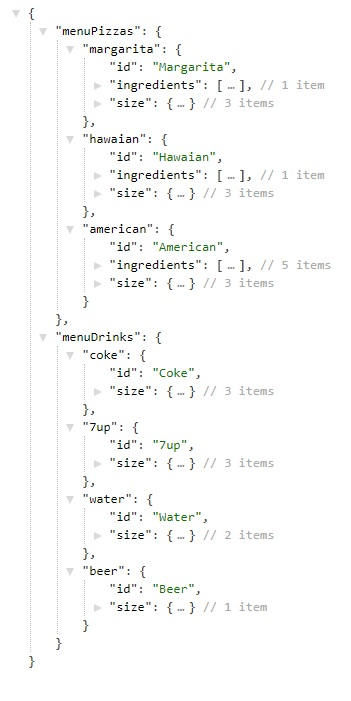
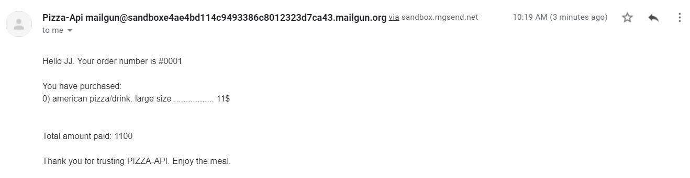

<h1>Pizza - API</h1>
<h2>How to use the API</h2>

There are 6 different endpoints and 15 methods implemented. I won´t documentate all methods, just what we need most for the homework.

<h2>Features I want to comment:</h2>

<b>dotEnvReader:</b> to keep the private keys hidden from github. I am sharing my keys with the reviewers of this homework, please erase them after checking my homework.

<b>loggingWatcher:</b> I made the File system to get the users that are currently logged in. loggingWatcher will log out users that didn´t log out after 1 hour of incativity.  What is inactivity? read the next feature to understand it.

<b>Automatic extension of loggin token:</b> some endpoints requires that the server checks if the user is logged in correctly, everytime the server verifies a correct log in, the token is automaticly extended for another hour, as an activity has been detected. No calls to endpoints that verifies a correct loggin will end up in inactivity.

<b>objectContractChecker:</b> Checking all entry data in every endpoint and method, generates repetitive line codes. I created some general check to prevent repetitive code.

<b>Email Validation:</b> We send a request to an API that checks if an email is valid or not, only used when sign in.

<h3>HTTPS NOT SUPPORTED</h3>

<h2>Walkthrough</h2>

You must run the program with the command <b><i>node index.js</i></b> and after that you could go to POSTMAN

<ol>
    <li>Create a new user: 
        <ul>
            <li>url: http://localhost:3002/users</li>
            <li>body raw JSON: {  
                    <blockquote>"name": "JJ", 
                    "email":"zitrojj@gmail.com", 
                    "password":"123456", 
                    "address":"El Rio, Arico. CP: 38593", 
                    "streetAddress":"calle san bartolome, 49" 
                    </blockquote>
                }
            </li>
            <li>Expected behavior: response 200, response body = {}</li>
        </ul>
    </li>
    <li>Log in: 
        <ul>
            <li>url: http://localhost:3002/logging</li>
            <li>body raw JSON: { 
                    <blockquote>"email":"zitrojj@gmail.com", 
                    "password":"123456", 
                    </blockquote>
                }
            </li>
            <li>Expected behavior: response 200, response with 2 objects. tokenData stored in a folder currentlyLoggedIn, and a userData stored in a folder users,   And a  body = {
                <blockquote>"currentlyLoggedIn": { 
                    "email": "zitrojj@gmail.com", 
                    "token": "a7b7VbJouXCJ6DHwZyim", 
                    "expires": 1628243161208</blockquote>
                }, <blockquote>
                "user": { 
                    "name": "JJ", 
                    "email": "zitrojj@gmail.com", 
                    "address": "El Rio, Arico. CP: 38593", 
                    "hashedPassword": "088b35ff75eb956aeed6b4ae761a627f5f5100d6dcd5f972adee9920e204dd7f", 
                    "streetAddress": "calle san bartolome, 49", 
                    "sessionToken": { 
                        "token": "a7b7VbJouXCJ6DHwZyim", 
                        "expires": 1628243161208 
                    }</blockquote>
                }
            }</li>
        </ul>
    </li>
    <li>Get the MENU: 
        <ul>
            <li>url: http://localhost:3002/menu?email=zitrojj@gmail.com</li>
            <li>headers: token=a7b7VbJouXCJ6DHwZyim // The token you received when logged in
            </li>
            <li>Expected behavior: response 200, response body = {  menuPizza: array with the Pizza menu 
            menuDrinks: array with the Drinks menu  }   
            </li>
        </ul>
    </li>
    <li>Create a new order (ADD PRODUCT TO SHOPPINGCART) and doing as many times as you want: 
        <ul>
            <li>url: http://localhost:3002/shoppingcart</li>
            <li>headers: token=a7b7VbJouXCJ6DHwZyim // The token you received when logged in
            </li>
            <li>body raw JSON: {  
                    <blockquote>
                    "email":"zitrojj@gmail.com", 
                    "item":"hawaian", 
                    "size":"large", 
                    "note":"please dont put pineapples" // this field is optional 
                    </blockquote>
                }
            </li>
            <li>Expected behavior: response 200, response body = {  
            <blockquote>"id": "american", 
            "size": "large", 
            "price": 11, 
            "date": 1628241105886, 
            "index": 0 // this field is important if you want to change it later or delete it (another endpoint shoppingcart/item can handle this requests)
             </blockquote>
            }   </li>
            <li>Repeat this step as many times as you want.</li>
        </ul>
    </li>
    <li>Let's step into the payment (checkout): 
        <ul>
            <li>url: http://localhost:3002/checkout</li>
            <li>headers: token=a7b7VbJouXCJ6DHwZyim // The token you received when logged in
            </li>
            <li>Body raw JSON: {
                <blockquote>"email":"zitrojj@gmail.com"</blockquote>
                }
            </li>
            <li>Expected behavior: response 200, response body = {  
            "Message": "New order succesfully created number: 0001"  }   
            </li>
            <li>CHECK THE CONSOLE LOG:  
                Payment went through, status code:  200  
                OrderId has been stored correctly in folder .data/orderId:  
                returning response:  200 {"Message":"New order succesfully created number: 0001"} 
                Email sent to:  zitrojj@gmail.com StatusCode:  200 
                
            </li>
        </ul>
    </li>
</ol>

<h2>List of useful methods not included in the walkthrough</h2>
<ol>
    <li>Log out. its a DELETE method in <i>logging</i> endpoint. Just requires a token in headers.</li>
    <li>Delete a user or change password, or address or streetAddress of the User. They are DELETE or PUT methods respectivly in <i>users</i> endpoint.</li>
    <li>Extend log in token. It's a PUT method in <i>logging</i> endpoint </li>
    <li>Empting the shoppincart. It's a DELETE method in <i>shoppingcart</i> endpoint </li>
    <li>Replacing an item in the shoppincart or deleting the item. They are PUT or DELETE methods respectivly in <i>shoppingcart/item</i> endpoint. NOTE: the index of the item is required with more data</li>
</ol>
<h3>These last list of methods are not documented 
rigorously, but reading the comments in the code can show you how they work easily.</h3>

